# ARGUS

<p align="center">
  
</p>

<p align="center">
  
  
  
  
</p>

---

ARGUS is a hyper-autonomous network reconnaissance engine implemented in Rust. It eliminates the manual scripting layer of penetration testing by employing a Large Language Model (LLM) to analyze discovery data and orchestrate secondary reconnaissance tools in real-time.

---

## EXECUTION LOG

```text
TARGET: 192.168.1.10
[SYSTEM] INITIALIZING ASYNCHRONOUS RECONNAISSANCE ENGINE
[OK] DISCOVERED: 22/TCP (SSH), 80/TCP (HTTP)
[AGENT] ANALYSIS: WEB SERVER DETECTED ON PORT 80. PRIORITIZING SERVICE ENUMERATION.
[AGENT] ACTION: RUN_NIKTO
[AGENT] ACTION: RUN_GOBUSTER (DIRECTORY BRUTE-FORCE)
[AGENT] STATUS: SENSITIVE DIRECTORY DISCOVERED (/ADMIN/LOGIN.PHP)
[SYSTEM] RECONNAISSANCE CYCLE COMPLETE. REPORT GENERATED.
```

## CORE SPECIFICATIONS

- PERFORMANCE: Built with Rust for zero-runtime overhead and memory safety.
- AUTONOMY: Driven by the Rig-core framework for goal-oriented decision making.
- ADAPTIVE: Maintains a dynamic context graph to adjust strategy based on tool output.
- INTEGRATION: Native support for Nmap, Nikto, and Gobuster.
- TOOLCHAIN: Managed via uv for deterministic builds and execution.

## ARCHITECTURE

- RUNTIME: Tokio (Asynchronous I/O)
- FRAMEWORK: Rig (Intelligent Agent Graph)
- DEPENDENCIES: Managed via uv
- INTERFACE: Clap v4 (Typed CLI)

---

## INSTALLATION

### VIA UV
```bash
git clone https://github.com/kanywst/argus
cd argus
uv build
```

### VIA CARGO
```bash
cargo install --path .
```

---

## AGENT CONFIGURATION

### LOCAL (OLLAMA)
1. Install Ollama (ollama.com)
2. Pull required model:
   ```bash
   ollama pull llama3
   ```
3. Execute Argus:
   ```bash
   argus <target> --ai --provider ollama --model llama3
   ```

### CLOUD (OPENAI)
1. Set API key:
   ```bash
   export OPENAI_API_KEY="sk-..."
   ```
2. Execute Argus:
   ```bash
   argus <target> --ai
   ```

---

## CLI ARGUMENTS

```bash
argus [OPTIONS] <TARGET>
```

| ARGUMENT | DESCRIPTION | DEFAULT |
|:---|:---|:---|
| --ai | Enable autonomous agent loop | false |
| -w, --wordlist | Path to directory wordlist | /usr/share/dirb/wordlists/big.txt |
| -o, --output | Output directory | results |
| --provider | AI backend (openai, ollama) | openai |
| --model | LLM model name | gpt-4o |

---

## DISCLAIMER

This software is provided for authorized security testing and educational purposes only. Unauthorized access to computer systems is illegal. The developers assume no liability for the misuse of this tool.

## LICENSE

MIT License. See LICENSE for details.

---
<p align="center">DEVELOPED BY KANYWST</p>